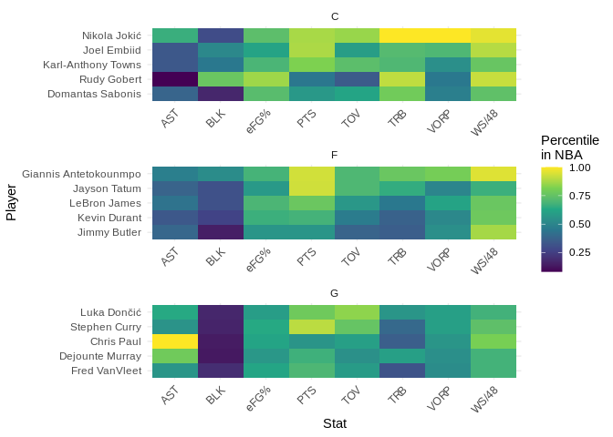

# NBA Data Analysis and Visualization

Doing some analysis and visualization of NBA data, for fun.

Data, so far, are gathered from the wonderful [Basketball
Reference](https://www.basketball-reference.com/).

## Data as of 07:45AM June 18, 2024

### Team Standings

#### Eastern Conference

| Team               | Games | Div. |   W |   L |   W/L | Net Rating |
|:-------------------|------:|:-----|----:|----:|------:|-----------:|
| Toronto Raptors    |    82 | A    |  41 |  41 | 0.500 |       1.51 |
| Chicago Bulls      |    82 | C    |  40 |  42 | 0.488 |       1.36 |
| Washington Wizards |    82 | SE   |  35 |  47 | 0.427 |      -1.28 |
| Indiana Pacers     |    82 | C    |  35 |  47 | 0.427 |      -3.16 |
| Orlando Magic      |    82 | SE   |  34 |  48 | 0.415 |      -2.57 |
| Charlotte Hornets  |    82 | SE   |  27 |  55 | 0.329 |      -6.28 |
| Detroit Pistons    |    82 | C    |  17 |  65 | 0.207 |      -8.33 |

#### Western Conference

| Team                   | Games | Div. |   W |   L |   W/L | Net Rating |
|:-----------------------|------:|:-----|----:|----:|------:|-----------:|
| New Orleans Pelicans   |    82 | SW   |  42 |  40 | 0.512 |       1.88 |
| Oklahoma City Thunder  |    82 | NW   |  40 |  42 | 0.488 |       1.03 |
| Dallas Mavericks       |    82 | SW   |  38 |  44 | 0.463 |       0.06 |
| Utah Jazz              |    82 | NW   |  37 |  45 | 0.451 |      -1.02 |
| Portland Trail Blazers |    82 | NW   |  33 |  49 | 0.402 |      -4.11 |
| Houston Rockets        |    82 | SW   |  22 |  60 | 0.268 |      -8.02 |
| San Antonio Spurs      |    82 | SW   |  22 |  60 | 0.268 |      -9.85 |

### Individual Stats

#### PPG Leaders

| player                  | tm  |  pts |   g |  ppg |
|:------------------------|:----|-----:|----:|-----:|
| Joel Embiid             | PHI | 2183 |  66 | 33.1 |
| Luka Dončić             | DAL | 2138 |  66 | 32.4 |
| Damian Lillard          | POR | 1866 |  58 | 32.2 |
| Shai Gilgeous-Alexander | OKC | 2135 |  68 | 31.4 |
| Giannis Antetokounmpo   | MIL | 1959 |  63 | 31.1 |

#### VORP Leaders

| player                  | tm  | vorp |
|:------------------------|:----|-----:|
| Nikola Jokić            | DEN |  8.8 |
| Luka Dončić             | DAL |  6.6 |
| Joel Embiid             | PHI |  6.4 |
| Jimmy Butler            | MIA |  5.8 |
| Shai Gilgeous-Alexander | OKC |  5.6 |

#### Advanced Stat Leaders

Top 5 players by VORP for C, F, and G.
<!-- -->
