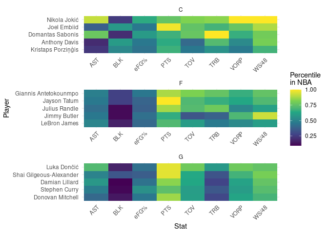

# NBA Data Analysis and Visualization

Doing some analysis and visualization of NBA data, for fun.

Data, so far, are gathered from the wonderful [Basketball
Reference](https://www.basketball-reference.com/).

## Data as of 07:43AM April 07, 2023

### Team Standings

#### Eastern Conference

| Team                | Games | Div. |   W |   L |   W/L | Net Rating |
|:--------------------|------:|:-----|----:|----:|------:|-----------:|
| Milwaukee Bucks     |    80 | C    |  58 |  22 | 0.725 |       4.07 |
| Boston Celtics      |    80 | A    |  55 |  25 | 0.688 |       6.54 |
| Philadelphia 76ers  |    80 | A    |  52 |  28 | 0.650 |       4.06 |
| Cleveland Cavaliers |    81 | C    |  51 |  30 | 0.630 |       5.82 |
| New York Knicks     |    80 | A    |  47 |  33 | 0.588 |       3.27 |
| Brooklyn Nets       |    80 | A    |  44 |  36 | 0.550 |       1.16 |
| Miami Heat          |    80 | SE   |  43 |  37 | 0.538 |      -0.51 |
| Atlanta Hawks       |    80 | SE   |  41 |  39 | 0.513 |       0.42 |
| Toronto Raptors     |    80 | A    |  40 |  40 | 0.500 |       1.60 |
| Chicago Bulls       |    80 | C    |  38 |  42 | 0.475 |       1.07 |
| Washington Wizards  |    80 | SE   |  34 |  46 | 0.425 |      -1.32 |
| Orlando Magic       |    80 | SE   |  34 |  46 | 0.425 |      -2.25 |
| Indiana Pacers      |    80 | C    |  34 |  46 | 0.425 |      -3.21 |
| Charlotte Hornets   |    80 | SE   |  26 |  54 | 0.325 |      -6.54 |
| Detroit Pistons     |    80 | C    |  16 |  64 | 0.200 |      -8.34 |

#### Western Conference

| Team                   | Games | Div. |   W |   L |   W/L | Net Rating |
|:-----------------------|------:|:-----|----:|----:|------:|-----------:|
| Denver Nuggets         |    80 | NW   |  52 |  28 | 0.650 |       3.28 |
| Memphis Grizzlies      |    80 | SW   |  50 |  30 | 0.625 |       3.93 |
| Sacramento Kings       |    80 | P    |  48 |  32 | 0.600 |       3.02 |
| Phoenix Suns           |    80 | P    |  45 |  35 | 0.563 |       2.40 |
| Golden State Warriors  |    80 | P    |  42 |  38 | 0.525 |       0.88 |
| Los Angeles Clippers   |    80 | P    |  42 |  38 | 0.525 |       0.33 |
| New Orleans Pelicans   |    80 | SW   |  41 |  39 | 0.513 |       1.89 |
| Los Angeles Lakers     |    80 | P    |  41 |  39 | 0.513 |       0.27 |
| Minnesota Timberwolves |    80 | NW   |  40 |  40 | 0.500 |      -0.28 |
| Oklahoma City Thunder  |    81 | NW   |  39 |  42 | 0.481 |       0.85 |
| Dallas Mavericks       |    80 | SW   |  38 |  42 | 0.475 |       0.34 |
| Utah Jazz              |    80 | NW   |  36 |  44 | 0.450 |      -0.96 |
| Portland Trail Blazers |    80 | NW   |  33 |  47 | 0.413 |      -3.44 |
| San Antonio Spurs      |    80 | SW   |  21 |  59 | 0.263 |     -10.10 |
| Houston Rockets        |    80 | SW   |  20 |  60 | 0.250 |      -8.31 |

### Individual Stats

#### PPG Leaders

| player                  | tm  |  pts |   g |  ppg |
|:------------------------|:----|-----:|----:|-----:|
| Joel Embiid             | PHI | 2183 |  66 | 33.1 |
| Luka Dončić             | DAL | 2125 |  65 | 32.7 |
| Damian Lillard          | POR | 1866 |  58 | 32.2 |
| Shai Gilgeous-Alexander | OKC | 2135 |  68 | 31.4 |
| Giannis Antetokounmpo   | MIL | 1959 |  63 | 31.1 |

#### VORP Leaders

| player                  | tm  | vorp |
|:------------------------|:----|-----:|
| Nikola Jokić            | DEN |  8.8 |
| Luka Dončić             | DAL |  6.6 |
| Joel Embiid             | PHI |  6.4 |
| Jimmy Butler            | MIA |  5.7 |
| Shai Gilgeous-Alexander | OKC |  5.6 |

#### Advanced Stat Leaders

Top 5 players by VORP for C, F, and G.
<!-- -->
